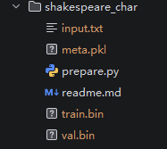
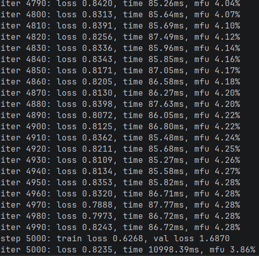
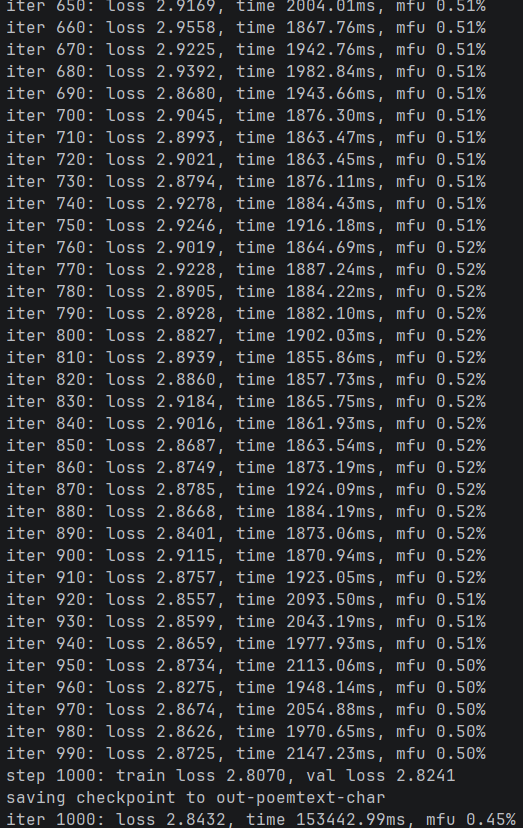
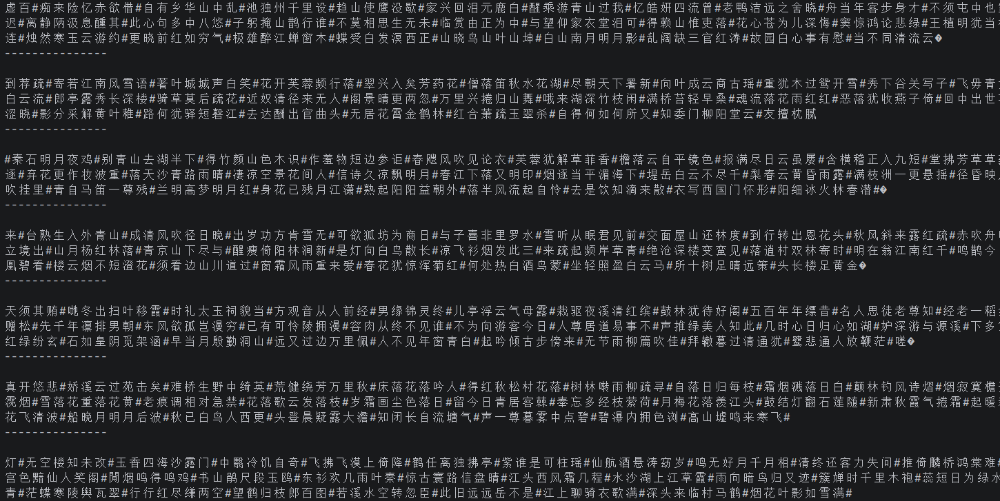

# nanoGPT
⽬前市⾯上⼤多数可⽤的GPT都⾮常的庞⼤，初学者很难学习和复现。nanoGPT项⽬[1]是使⽤Pytorch对GPT的⼀个复现，
包括训练和推理，其⽬的是做到⼩巧、⼲净、可解释性并且能⽤于教育。如果市⾯上的GPT模型是⼀艘“航空⺟ 舰”的话，
nanoGPT可看做是⼀艘游艇，“⿇雀虽⼩，五张俱全”，对于初学者的⼊⻔学习有重要的意义。
本案例将训练两个模型：⼀个是使⽤由58000⾸诗词构成的诗歌数据集，
训练⼀个歌词⽣成的GPT；另⼀个是使⽤约 124万个字符构成的《天⻰⼋部》⽂本，训练⼀个具有《天⻰⼋部》⻛格的GPT。

# 复现实验nanoGPT实验
## 安装配置库
`pip install torch numpy transformers datasets tiktoken wandb tqdm`
## 生成数据集
运行`python data/shakespeare_char/prepare.py`
生成数据集莎士比亚input.txt文件  

  
## 训练数据集
运行`python train.py config/train_shakespeare_char.py`  
其训练过程截图：   
  
## 运行效果
运行`python sample.py --out_dir=out-shakespeare-char`  
通过采样脚本进行抽取结果  
其结果（部分）：
```
Overriding: out_dir = out-shakespeare-char
number of parameters: 10.65M
Loading meta from data\shakespeare_char\meta.pkl...


Clown:
So, who? and it shall bear the way
Of the grave that I am supposed foul and very redeems.

Shepherd:
What's a wizard with the tofging come and thing,
We might send in this maid over-banished prepared;
And well in a wallow up, on him so shrink.

Shepherd:
But I will attorney him.

Clown:
He knocks not what evils I have done with him;
But look your highness dangerous for a sight!

Shepherd:
Menenius, a Prince, Sir, and Norfolk,
Should bad all his grace hither to a rage
His hands and for hi
---------------

Men pardon me, you shall have hang you; I see
your father than the shepherd: he will but be so gone.

Shepherd:
Here is.

AUTOLYCUS:
He was a servant when it stands it.

LARTIUS:
My liege.

AUFIDIUS:
Why, my lord?

Clown:
I have no more, if I have so many have been with
him to me way for the vield of Corioli large.

AUTOLYCUS:
I say it is not to be not.

CORIOLANUS:
But to this often nor the sun of Rome, nor what thou wilt say
this belly a punishment and back watch-time to the sea?
Good knee you
---------------

Men than I beseech your husband;
And yet I said, I see this double council or love
As yourselves, sir; tell me, first, I will tell you.

BUCKINGHAM:
I will be cause your age the crown.

KING RICHARD III:
Good lord, brave sir, but madam:
That yet I will not speak a fool, and have left me so.
The old conscience did some crown of him;
And back your shin; you shall be thus a quarrel hate your grace.

KING RICHARD II:
The babe where you hear, no tongue.

KING RICHARD II:
First, I am not a little son

---------------
```

# 将采用唐诗作为训练数据进行训练（由于训练数据集过大，训练慢，减少了一些参数）
其步骤和上述一致，只是将数据集修改为唐诗
修改参数如下：
```
out_dir = 'out-poemtext-char'
eval_interval = 500 # keep frequent because we'll overfit
eval_iters = 100
log_interval = 10 # don't print too too often
compile = False
always_save_checkpoint = False

dataset = 'poemtext'
gradient_accumulation_steps = 1
batch_size = 64
block_size = 256 # context of up to 256 previous characters

n_layer = 6
n_head = 6
n_embd = 384
dropout = 0.2

learning_rate = 1e-3 # with baby networks can afford to go a bit higher
max_iters = 1000
lr_decay_iters = 1000 # make equal to max_iters usually
min_lr = 1e-4 # learning_rate / 10 usually
beta2 = 0.99 # make a bit bigger because number of tokens per iter is small

warmup_iters = 100 # not super necessary potentially
```
其训练过程截图：  


其最后输出结果截图：  


# 思考题
## 1使用《天龙八部》数据集训练一个GPT模形，并生成结果
其过程与训练唐诗数据集的步骤一致，只是将数据集修改为《天龙八部》数据集，
先进行数据集的清洗，将数据分别为`train.bin`和`val.bin`文件
然后再congig文件中添加文件：`config/train_tianlong_char.py`
再运行`python train.py config/train_tianlong_char.py`进行训练
然后运行`python sample.py --out_dir=out-tianlong-char`进行抽取结果

## 2训练文件参数含义与修改实验
在 `config/train_poemtext_char.py `中，
我们看到的参数是用于控制 GPT 模型训练的各种超参数。理解这些参数的意义，
并通过调整它们来观察生成效果的变化，是深入掌握模型训练的关键。
下面逐一解释常见参数的含义，并给出一些可行的修改建议及其预期影响。
### 基本路径与日志参数

| 参数 | 含义 | 说明与建议 |
| :--- | :--- | :--- |
| `out_dir` | 输出目录，用于保存模型 checkpoint、日志等 | 例如 `'out-poemtext-char'`，训练过程中生成的模型文件和中间结果将存储在此路径下。 |
| `eval_interval` | 每多少次迭代在验证集上评估一次损失 | 如 250，频繁评估可实时监控模型，但会减慢训练。可根据总迭代次数调整（例如 `max_iters/10`）。 |
| `eval_iters` | 评估时使用的验证集迭代次数 | 如 200，取值越大评估越准确，但耗时增加。通常 100~500 之间。 |
| `log_interval` | 每多少次迭代打印一次训练损失 | 如 10，控制终端输出频率，不影响训练速度，但太频繁会刷屏。 |
| `always_save_checkpoint` | 是否每次评估后都保存 checkpoint | 一般设为 `False`，仅在验证损失改善时保存，避免频繁写磁盘。调试时可临时开启。 |
| `init_from` | 初始化模型的方式 | 可选 `'scratch'`（从头训练）、`'resume'`（从 checkpoint 恢复）、`'gpt2*'`（加载预训练 GPT-2 权重）。 |
| `wandb_log` | 是否启用 Weights & Biases 日志 | 若设为 `True`，需配置 `wandb_project` 等，便于可视化训练曲线。 |
| `wandb_project` | W&B 项目名称 | 如 `'poemtext-char'`，仅当 `wandb_log=True` 时有效。 |
| `wandb_run_name` | W&B 运行名称 | 可选，用于区分不同实验。 |

### 数据集参数

| 参数 | 含义 | 说明与建议 |
| :--- | :--- | :--- |
| `dataset` | 数据集名称 | 对应 `data/` 下的子目录，如 `'poemtext'`，需包含 `train.bin` 和 `val.bin` 等预处理文件。 |
| `gradient_accumulation_steps` | 梯度累积步数 | 用于模拟更大批次，总批次大小 = `batch_size` * `gradient_accumulation_steps`。显存不足时可增大此值。 |
| `batch_size` | 每个 GPU 上的批次大小（单次前向传播的样本数） | 受显存限制，通常设为 2 的幂次（如 16, 32, 64）。越大梯度估计越准，但需调整学习率。 |
| `block_size` | 模型处理的最大上下文长度（token 数） | 对于字符级模型，常设为 128~512。值越大，计算量线性增长，但能捕捉更长依赖。 |

### 模型结构参数

| 参数 | 含义 | 说明与建议 |
| :--- | :--- | :--- |
| `n_layer` | Transformer 解码器层数 | 如 6，增加层数可提升模型容量，但参数量和计算成本也增加。小数据集宜用较少层（如 4~6）。 |
| `n_head` | 多头注意力头数 | 如 6，需保证 `n_embd % n_head == 0`。更多头有助于模型关注不同子空间，但过多可能冗余。 |
| `n_embd` | 嵌入向量维度 | 如 384，维度越高表示能力越强，但参数量爆炸（与 `n_layer` 乘积关系）。字符级任务常用 256~512。 |
| `dropout` | Dropout 概率 | 如 0.2，用于防止过拟合。训练集较小时可适当增大（如 0.3），大模型或大数据集可减小（如 0.1）。 |
| `bias` | 是否在 Linear 和 LayerNorm 层中使用偏置项 | 默认为 `True`，但一些实现（如 GPT-2）中某些层无偏置。关闭可略微减少参数量。 |

### 优化器与学习率参数

| 参数 | 含义 | 说明与建议 |
| :--- | :--- | :--- |
| `learning_rate` | 初始学习率 | 如 1e-3，对于小模型可稍高，但需配合预热和衰减。通常范围 1e-4 ~ 1e-3。 |
| `max_iters` | 总训练迭代步数 | 如 5000，决定了训练时长。可根据损失曲线调整，若损失已平缓可提前停止。 |
| `weight_decay` | AdamW 优化器的权重衰减系数 | 如 1e-1，用于正则化，防止过拟合。常用值 0.1 ~ 0.01。 |
| `beta1` | Adam 的一阶矩衰减率 | 默认 0.9，通常保持不动。 |
| `beta2` | Adam 的二阶矩衰减率 | 默认 0.99 或 0.95（小批量时可增大）。 |
| `grad_clip` | 梯度裁剪的最大范数 | 如 1.0，防止梯度爆炸，稳定训练。设为 0 或 `None` 表示不裁剪。 |
| `decay_lr` | 是否使用学习率衰减 | 布尔值，通常 `True`。配合 `warmup_iters`, `lr_decay_iters`, `min_lr` 使用。 |
| `warmup_iters` | 学习率预热步数 | 如 100，在前 `warmup_iters` 步内将学习率从 0 线性增加到 `learning_rate`，有助于稳定初始训练。 |
| `lr_decay_iters` | 学习率衰减的总步数 | 通常等于 `max_iters`，使得学习率在训练结束时降到 `min_lr`。若小于 `max_iters`，则之后学习率保持 `min_lr`。 |
| `min_lr` | 最小学习率 | 如 1e-4，通常为 `learning_rate/10`，衰减终止时的学习率。 |

### 系统与硬件参数

| 参数 | 含义 | 说明与建议 |
| :--- | :--- | :--- |
| `backend` | 分布式后端 | 如 `'nccl'`（GPU）、`'gloo'`（CPU）。单卡训练无需关心。 |
| `device` | 训练设备 | 自动检测，可设为 `'cuda'`、`'cpu'` 或 `'mps'`（Apple Silicon）。 |
| `dtype` | 数据类型 | 如 `'float16'`、`'bfloat16'`、`'float32'`。混合精度可加速并节省显存，但需硬件支持。 |
| `compile` | 是否使用 PyTorch 2.0 编译模型 | 布尔值。开启可提速 20~30%，但首次运行有编译开销，且可能与某些操作不兼容。 |


## 3模型采样文件 `sample.py` 的推理过程

`sample.py` 脚本主要负责加载训练好的 GPT 模型权重，并根据给定的起始文本（Prompt）进行自回归生成。其核心推理流程如下：

### 1. 加载模型与编码器
*   **加载 Checkpoint**：从指定的输出目录（`out_dir`）读取训练保存的模型文件（如 `ckpt.pt`），恢复模型结构和权重。
*   **初始化编解码器**：加载对应的元数据（`meta.pkl`），初始化字符级的编码器（`encode`）和解码器（`decode`）。编码器将字符映射为整数索引，解码器则将索引还原为可读字符。

### 2. 设置生成参数
常见的采样超参数包括：
*   **`start`**：起始提示文本。若为空，通常从换行符 `\n` 或特定开始符启动。
*   **`max_new_tokens`**：限制生成的最大字符数量。
*   **`temperature`**：控制采样的随机性。
    *   $T > 1$：概率分布更平滑，生成结果更多样但也更不可控。
    *   $T < 1$：概率分布更尖锐，倾向于选择高概率字符，生成更确定。
    *   $T \to 0$：退化为贪心解码（Greedy Decoding），每次只选概率最大的词。
*   **`top_k`**：仅从概率最高的 $k$ 个候选字符中采样，过滤低概率词，提升生成质量。
*   **`top_p` (Nucleus Sampling)**：在累积概率达到 $p$ 的最小候选集内采样，可与 `top_k` 结合使用。

### 3. 推理循环（逐字符生成）
模型采用**自回归（Auto-regressive）**方式工作：每次预测一个字符，将其追加到输入序列末尾，作为下一次预测的上下文。具体步骤如下：

1.  **编码输入**：将起始文本通过编码器转换为 token 序列 $x$，形状通常为 `(1, T)`，其中 $T$ 为当前序列长度。
2.  **生成循环**：重复执行直到达到 `max_new_tokens` 或遇到停止符：
    *   **上下文截断**：若当前序列长度超过模型的 `block_size`，需截断最左侧部分，仅保留最近的 `block_size` 个 token（`idx_cond = idx[:, -block_size:]`）。
    *   **前向传播**：将处理后的序列输入模型，得到 logits，形状为 `(1, T, vocab_size)`。
    *   **提取最后一步**：仅取最后一个时间步的预测结果 `logits = logits[:, -1, :]`，并除以温度系数 `temperature`。
    *   **采样过滤**（可选）：
        *   若启用 `top_k`，将非前 $k$ 大的 logits 置为负无穷。
        *   若启用 `top_p`，对概率分布进行核采样过滤。
    *   **概率转换**：应用 `softmax` 函数将 logits 转换为概率分布。
    *   **随机采样**：根据概率分布随机抽取下一个 token 索引 `next_token`（使用 `torch.multinomial`）。
    *   **序列拼接**：将 `next_token` 拼接到原序列 $x$ 后方，形成新的输入序列。
3.  **解码输出**：循环结束后，将最终生成的完整 token 序列通过解码器还原为文本并打印或保存。

### 4. 关键实现细节
*   **无梯度计算**：推理过程包裹在 `torch.no_grad()` 上下文中，禁止计算梯度以节省显存并加速推理。
*   **上下文窗口限制**：必须严格遵守 `block_size` 限制，否则会导致模型报错或预测错误。
*   **常用采样策略组合**：
    *   `temperature=1.0, top_k=0`：纯随机采样，多样性高但可能逻辑混乱。
    *   `temperature=0.8, top_k=40`：常用平衡组合，兼顾连贯性与创造性。
    *   `temperature=0.0` (或极小值)：贪心策略，结果最确定但容易陷入重复循环。

### 5. 核心代码逻辑示例
以下是简化后的生成函数核心逻辑：
```
def generate(model, idx, max_new_tokens, temperature=1.0, top_k=None):
    for _ in range(max_new_tokens):
        # 1. 截断输入以适应 block_size
        idx_cond = idx if idx.size(1) <= block_size else idx[:, -block_size:]
        
        # 2. 前向传播获取 logits
        logits, _ = model(idx_cond)
        
        # 3. 提取最后一个时间步并应用温度缩放
        logits = logits[:, -1, :] / temperature
        
        # 4. Top-K 过滤
        if top_k is not None:
            v, _ = torch.topk(logits, min(top_k, logits.size(-1)))
            logits[logits < v[:, [-1]]] = -float('Inf')
        
        # 5. 转换为概率分布
        probs = F.softmax(logits, dim=-1)
        
        # 6. 从分布中采样下一个 token
        idx_next = torch.multinomial(probs, num_samples=1)
        
        # 7. 拼接序列
        idx = torch.cat((idx, idx_next), dim=1)
        
    return idx
```
### 6. 影响生成效果的因素
*   **温度（Temperature）**：过低导致文本重复、死板；过高导致胡言乱语、语法错误。
*   **Top-K / Top-P**：设置过小会限制模型的创造力，设置过大则可能引入噪声和不相关字符。
*   **起始文本（Prompt）**：高质量的 Prompt 能有效引导模型进入特定的主题或风格。
*   **模型能力**：模型容量（参数量）和训练充分度是基础。若模型欠拟合或容量过小，即使调整采样参数也难以生成流畅文本。
通过灵活调整 `sample.py` 中的这些参数，用户可以探索模型生成能力的边界，针对创意写作、代码生成或事实性问答等不同场景优化输出效果。

## License
本项目仅用于学习、研究与学术交流。